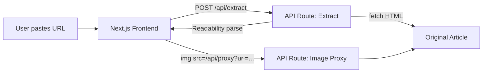

# Article Restyler Web App

## Architecture

A single **Next.js 14 (App Router)** project using **Tailwind CSS v4**. Everything runs in one process -- no separate backend needed. Content extraction happens in API routes (server-side), the frontend renders the restyled article.



## Tech Stack Rationale

- **Next.js 14 (App Router)** -- full-stack in one project; API routes handle server-side fetching (no CORS issues); React for UI; fast local dev with `next dev`
- **Tailwind CSS** -- utility-first CSS for rapid, consistent, modern styling
- **@mozilla/readability + jsdom** -- Mozilla's battle-tested article extraction (same engine as Firefox Reader View); strips nav/ads/footers and returns clean structured HTML with title, byline, and content
- **DOMPurify (via isomorphic-dompurify)** -- sanitize extracted HTML before rendering to prevent XSS

## Key Design Decisions

### Content Extraction (API Route: `/api/extract`)
1. Fetch the raw HTML from the provided URL using `fetch` (server-side, no CORS)
2. Parse with `jsdom` to create a DOM
3. Run `@mozilla/readability`'s `Readability` to extract: **title**, **byline**, **excerpt**, **content** (clean HTML), **siteName**
4. Rewrite all `` `src` attributes to go through the image proxy: `/api/proxy?url=<encoded-original-url>`
5. Return JSON: `{ title, byline, siteName, excerpt, content, originalUrl }`

### Image Proxy (API Route: `/api/proxy`)
- Accepts a `url` query parameter, fetches the image server-side, and streams it back with proper `Content-Type`
- Avoids CORS and hotlinking blocks from origin servers
- Caches responses with `Cache-Control` headers

### Frontend
- Single page with a URL input bar at the top
- On submit, calls `/api/extract`, then renders the structured content
- Uses `dangerouslySetInnerHTML` with DOMPurify-sanitized content
- Tailwind styles applied via a scoped CSS class on the article container that targets child HTML elements (`h1`, `h2`, `p`, `img`, `pre`, `code`, `ul`, `ol`, `blockquote`, etc.)

### Style: "Midnight Editorial"
Inspired by the Wiz blog but with a distinct high-contrast dark theme:
- **Background**: near-black (`#0a0a0f`) with subtle noise/grain texture
- **Text**: off-white (`#e8e8ed`) for body, pure white for headings
- **Accent**: electric blue (`#3b82f6`) for links and highlights
- **Typography**: system font stack with generous line-height (1.8), large body text (18px), bold headings with extra letter-spacing
- **Images**: full-width with subtle border-radius, soft shadow, slight hover zoom
- **Code blocks**: dark gray background with syntax-colored monospace text
- **Blockquotes**: left blue border, slightly lighter background
- **Layout**: max-width 720px centered, generous vertical rhythm

## Project Structure

```
article-restyler/
  app/
    page.tsx              -- main page (URL input + article display)
    layout.tsx            -- root layout with global styles
    globals.css           -- Tailwind imports + article prose styles
    api/
      extract/route.ts    -- content extraction endpoint
      proxy/route.ts      -- image proxy endpoint
  components/
    ArticleView.tsx       -- renders the restyled article content
    UrlInput.tsx          -- URL input form component
  lib/
    extractor.ts          -- Readability extraction logic
    sanitize.ts           -- DOMPurify wrapper
  package.json
  tailwind.config.ts
  next.config.ts
```

## Dependencies

- `next` (14.x), `react`, `react-dom`
- `@mozilla/readability` -- article content extraction
- `jsdom` -- server-side DOM for Readability
- `isomorphic-dompurify` -- HTML sanitization
- `tailwindcss`, `postcss`, `autoprefixer`
